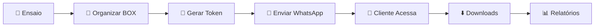

# 📸 Gabriel Lima Retratos - Sistema Completo

<div align="center">


**Sistema profissional de galeria de fotos com autenticação por tokens, integração com BOX, marca d'água automática e design elegante.**

[📸 Ver Demo](https://gabriellima-retratos.github.io) • [📞 Contato](https://wa.me/5579981338664) • [📋 Documentação](#-instalação-e-configuração)

</div>

---

## 🎯 Características Principais

<table>
<tr>
<td width="50%">

### 🌟 **Frontend**
- ✅ Site profissional responsivo
- ✅ Carrossel elegante de imagens
- ✅ Portfolio filtrado por categoria
- ✅ Formulário de contato integrado
- ✅ Design moderno e elegante
- ✅ SEO otimizado

</td>
<td width="50%">

### 🔐 **Backend & Segurança**
- ✅ Sistema de tokens únicos
- ✅ Integração com BOX API
- ✅ Marca d'água automática
- ✅ Downloads protegidos
- ✅ Relatórios em Python
- ✅ Logs de acesso detalhados

</td>
</tr>
</table>

---

## 📁 Estrutura do Projeto

```bash
gabriel-lima-retratos/
├── 📄 index.html              # Página principal
├── 📄 galeria.html            # Área do cliente
├── 📁 css/
│   ├── 🎨 style.css           # Estilos principais
│   └── 🎨 galeria.css         # Estilos da galeria
├── 📁 js/
│   ├── ⚡ main.js             # JavaScript principal
│   ├── 🔐 auth.js             # Sistema de autenticação
│   ├── 📦 box-api.js          # Integração com BOX
│   ├── 🖼️ watermark.js        # Sistema de marca d'água
│   ├── 🖥️ galeria.js          # Controle da galeria
│   └── ⚙️ config.js           # Configurações do sistema
├── 📁 assets/
│   ├── 🖼️ logo.png            # Logo para marca d'água
│   └── 🎯 favicon.png         # Favicon do site
├── 📁 python/
│   ├── 🐍 main.py             # Menu principal
│   ├── 🎫 gerar_token.py      # Gerador de tokens
│   └── 📊 relatorio.py        # Relatórios de clientes
├── 📊 tokens.json             # Arquivo de tokens (gerado)
└── 📚 README.md               # Esta documentação
```

---

## 🚀 Instalação e Configuração

### 1️⃣ **Configuração Básica**

```bash
# 1. Clone o repositório
git clone https://github.com/GabrieLima-dev/gabriel-lima-retratos.git
cd gabriel-lima-retratos

# 2. Configure suas informações
# Edite js/config.js com seus dados
```

**Configure suas informações em `js/config.js`:**

```javascript
photographer: {
    name: 'Seu Nome',
    businessName: 'Seu Negócio', 
    phone: '5511999999999',
    instagram: '@seuinstagram',
    location: 'Sua Cidade, Estado'
}
```

### 2️⃣ **Configuração do BOX (Opcional)**

<details>
<summary>📦 <strong>Clique para ver configuração do BOX</strong></summary>

1. **Crie uma conta** no [BOX Developer Console](https://developer.box.com/)
2. **Crie uma nova aplicação** do tipo "Custom App"
3. **Configure OAuth 2.0** e anote as credenciais
4. **Atualize** `js/config.js`:

```javascript
box: {
    clientId: 'SEU_BOX_CLIENT_ID',
    clientSecret: 'SEU_BOX_CLIENT_SECRET',
    enableMockData: false // Mudar para false em produção
}
```

</details>

### 3️⃣ **Sistema Python de Tokens**

```bash
# 1. Instale Python 3.7+
python --version

# 2. Execute o sistema
python main.py

# 3. Gere tokens para seus clientes
# 4. Envie o link via WhatsApp
```

---

## 📱 Como Usar

<table>
<tr>
<td width="50%">

### 👨‍💼 **Para o Fotógrafo**

1. 📁 **Organize as fotos** no BOX por pastas de cliente
2. 🐍 **Execute**: `python main.py`
3. 🎫 **Gere um token** com dados do cliente  
4. 📱 **Envie o link** via WhatsApp
5. 📊 **Acompanhe acessos** nos relatórios

</td>
<td width="50%">

### 👤 **Para o Cliente**

1. 📱 **Recebe o link** via WhatsApp
2. 🔐 **Acessa a galeria** e insere token
3. 👀 **Visualiza fotos** sem marca d'água
4. ⬇️ **Baixa as fotos** desejadas
5. ⌨️ **Navega facilmente** com teclado/touch

</td>
</tr>
</table>

---

## 🎨 Personalização

### **🎨 Cores e Design**

Edite as variáveis CSS em `css/style.css`:

```css
:root {
    --primary-color: #D4AF37;      /* 🟡 Cor principal (dourado) */
    --secondary-color: #2C2C2C;    /* ⚫ Cor secundária (cinza escuro) */
    --text-primary: #1A1A1A;       /* 📝 Texto principal (preto) */
    --text-secondary: #666666;     /* 📝 Texto secundário (cinza) */
    --white: #FFFFFF;              /* ⚪ Branco */
    --light-gray: #F8F9FA;         /* 🔘 Cinza claro */
}
```

### **⚙️ Configurações do Sistema**

Modifique `js/config.js` para ajustar:

```javascript
// 🖼️ Marca d'água
watermark: {
    text: 'SEU TEXTO AQUI',
    opacity: 0.3,              // 0.1 a 1.0
    size: 0.15,                // % da imagem
    position: 'center'         // center, topLeft, etc.
},

// 🔐 Autenticação  
auth: {
    maxRetries: 3,             // Tentativas de login
    sessionTimeout: 24 * 60 * 60 * 1000  // 24 horas
},

// 🖥️ Interface
ui: {
    theme: 'light',            // light, dark, auto
    animations: true,          // Ativar animações
    notificationDuration: 4000 // Duração notificações
}
```

---

## 📊 Sistema de Tokens

### **🏗️ Estrutura do Token**

```json
{
  "abc123def456": {
    "cliente": "Maria Silva",
    "categoria": "Gestantes", 
    "pasta": "Ensaio_Maria_Jan2024",
    "downloads_permitidos": true,
    "fotos_baixadas": [],
    "acessos": [],
    "criado_em": "2024-07-20T14:30:00.000Z",
    "expira_em": "2024-08-19T14:30:00.000Z",
    "ativo": true
  }
}
```

### **⌨️ Comandos Python**

```bash
# 🆕 Gerar novo token
python main.py → Opção 1

# 📊 Ver relatórios
python main.py → Opção 2  

# ❌ Desativar token
python relatorio.py → Opção 4

# 💾 Fazer backup
python main.py → Opção 3
```

### **🔄 Fluxo de Trabalho**



---

## 🔐 Segurança e Proteção

### **🛡️ Recursos de Proteção**

| Recurso | Descrição | Status |
|---------|-----------|--------|
| 🎫 **Tokens únicos** | Acesso individual por cliente | ✅ Ativo |
| ⏰ **Expiração automática** | Tokens expiram em 30 dias | ✅ Ativo |
| 🖼️ **Marca d'água** | Proteção automática para visitantes | ✅ Ativo |
| 🚫 **Anti clique direito** | Previne salvamento direto | ✅ Ativo |
| 📊 **Logs detalhados** | Rastreamento de todos acessos | ✅ Ativo |
| 🔄 **Validação contínua** | Verifica token a cada ação | ✅ Ativo |

### **🔒 Configurações de Segurança**

```javascript
// ⚙️ Configurações em config.js
auth: {
    maxRetries: 3,                    // 🔄 Tentativas de login
    sessionTimeout: 24 * 60 * 60 * 1000, // ⏰ Timeout sessão
    autoLogout: false                 // 🚪 Logout automático
},

watermark: {
    protectImages: true,              // 🛡️ Proteção de imagens  
    patternForVisitors: true,         // 🔲 Padrão para visitantes
    fallbackToText: true              // 📝 Fallback para texto
}
```

---

## 📱 Funcionalidades da Galeria

### **🎛️ Controles de Navegação**

<table>
<tr>
<td width="33%">

#### **👁️ Visualização**
- 🔲 **Grid** - Visão em grade
- 📋 **Lista** - Visão em lista  
- 🔍 **Busca** - Por nome/data
- 🏷️ **Filtros** - Por categoria
- ✅ **Seleção múltipla**

</td>
<td width="33%">

#### **⬇️ Downloads**
- 📄 **Individual** - Uma foto
- 📦 **Múltiplo** - Lote selecionado
- 📊 **Progresso** - Barra visual
- 🛡️ **Proteção** - Marca d'água
- 📈 **Rastreamento** - Logs

</td>
<td width="33%">

#### **⌨️ Navegação**
- 🖱️ **Mouse** - Cliques e scroll
- ⌨️ **Teclado** - Setas e shortcuts
- 👆 **Touch** - Gestos mobile
- 🖼️ **Lightbox** - Visualização ampla
- 📱 **Responsivo** - Todos devices

</td>
</tr>
</table>

### **⌨️ Atalhos de Teclado**

| Tecla | Ação | Contexto |
|-------|------|----------|
| `←` `→` | Navegar fotos | Lightbox |
| `ESC` | Fechar modal | Lightbox |
| `SPACE` | Baixar foto atual | Lightbox |
| `CTRL + A` | Selecionar todas | Galeria |
| `ENTER` | Abrir lightbox | Item focado |

---

## 🎛️ Configurações Avançadas

### **🌍 Ambiente: Desenvolvimento vs Produção**

```javascript
// 🧪 Desenvolvimento (localhost)
development: {
    enableConsoleLogging: true,    // 📝 Logs no console
    enableMockData: true,          // 🎭 Dados simulados
    showDebugInfo: true            // 🐛 Info de debug
}

// 🚀 Produção (site live)
development: {
    enableConsoleLogging: false,   // 🔇 Sem logs
    enableMockData: false,         // 📦 Dados reais do BOX
    showDebugInfo: false           // 🚫 Sem debug
}
```

### **⚡ Performance e Otimização**

```javascript
performance: {
    compressionQuality: 0.9,         // 🖼️ Qualidade das imagens (0-1)
    maxConcurrentDownloads: 3,       // 📥 Downloads simultâneos
    downloadDelay: 1000,             // ⏱️ Delay entre downloads (ms)
    enablePreloading: true,          // 🚀 Pré-carregamento
    cacheStrategy: 'session'         // 💾 Estratégia de cache
}
```

### **🎯 Recursos Opcionais**

```javascript
features: {
    enableSlideshow: true,           // 🎬 Apresentação automática
    enableZoom: true,                // 🔍 Zoom nas imagens
    enableFullscreen: true,          // 🖥️ Tela cheia
    enableMetadata: true,            // 📊 Info das fotos
    enableComments: false,           // 💬 Comentários
    enableShare: true                // 📤 Compartilhamento
}
```

---

## 🚀 Deploy e Hospedagem

### **📄 GitHub Pages (Recomendado)**

```bash
# 1. Criar repositório no GitHub
# 2. Upload dos arquivos
git add .
git commit -m "Initial commit"
git push origin main

# 3. Ativar GitHub Pages
# Settings → Pages → Source: Deploy from branch → main
```

**✅ Vantagens:** Gratuito, SSL automático, deploy automático

### **🌐 Netlify**

```bash
# 1. Conectar repositório GitHub no Netlify
# 2. Configurar build:
#    Build command: (vazio)
#    Publish directory: /
# 3. Deploy automático a cada commit
```

**✅ Vantagens:** CDN global, formulários, funções serverless

### **🖥️ Servidor Próprio**

```bash
# 1. Upload via FTP/SFTP
# 2. Configurar HTTPS (obrigatório)
# 3. Configurar domínio
# 4. Testar funcionalidades
```

**✅ Vantagens:** Controle total, sem limitações

---

## 📊 Analytics e Monitoramento

### **📈 Google Analytics**

```javascript
// ⚙️ Configuração em config.js
analytics: {
    googleAnalyticsId: 'GA_MEASUREMENT_ID',
    enableTracking: true,
    trackDownloads: true,           // 📥 Rastrear downloads
    trackViews: true,               // 👁️ Rastrear visualizações
    trackErrors: true               // 🐛 Rastrear erros
}
```

### **📊 Eventos Rastreados**

| Evento | Descrição | Dados |
|--------|-----------|-------|
| `page_view` | Página visitada | URL, timestamp |
| `token_used` | Token utilizado | Cliente, categoria |
| `photo_viewed` | Foto visualizada | Nome, índice |
| `photo_downloaded` | Download realizado | Nome, tamanho |
| `error_occurred` | Erro encontrado | Tipo, mensagem |

---

## 🛠️ Resolução de Problemas

### **❓ Problemas Comuns**

<details>
<summary><strong>❌ Fotos não carregam</strong></summary>

**Possíveis causas:**
- 🔗 Conexão com BOX falhou
- 🌐 Problema de CORS
- 📁 Pasta não encontrada

**Soluções:**
1. Verificar configuração BOX em `config.js`
2. Testar com `enableMockData: true`
3. Verificar logs do console (F12)
4. Confirmar permissões da pasta no BOX

</details>

<details>
<summary><strong>🎫 Token não funciona</strong></summary>

**Possíveis causas:**
- 📄 Arquivo `tokens.json` corrompido
- ⏰ Token expirado
- 🔒 Token desativado

**Soluções:**
1. Verificar formato do `tokens.json`
2. Gerar novo token no sistema Python
3. Conferir data de expiração
4. Testar em aba anônima do navegador

</details>

<details>
<summary><strong>🖼️ Marca d'água não aparece</strong></summary>

**Possíveis causas:**
- 🖼️ Logo não encontrada
- 🔐 Usuário já autenticado
- ⚙️ Configuração desabilitada

**Soluções:**
1. Verificar `assets/logo.png` existe
2. Testar em modo anônimo
3. Verificar `watermark.protectImages: true`
4. Limpar cache do navegador

</details>

<details>
<summary><strong>📥 Downloads falham</strong></summary>

**Possíveis causas:**
- 🔐 Permissões do BOX
- 🌐 URLs expiradas
- 📶 Conexão instável

**Soluções:**
1. Verificar permissões no BOX
2. Renovar tokens de acesso
3. Testar conexão internet
4. Verificar bloqueador de popup

</details>

### **🐛 Debug Mode**

Ative o debug em `config.js`:

```javascript
development: {
    enableConsoleLogging: true,      // 📝 Logs detalhados
    showDebugInfo: true,             // 🐛 Info na tela
    enableTestMode: true             // 🧪 Modo de teste
}
```

**Verificar logs:**
1. Abrir DevTools (`F12`)
2. Ir para aba `Console`
3. Procurar por erros em vermelho
4. Copiar mensagens para suporte

---

## 📞 Suporte e Contato

<div align="center">

### **🤝 Precisa de Ajuda?**

[](https://wa.me/5579981338664)
[](https://instagram.com/gabriellima_retratos)
[](https://github.com/GabrieLima-dev)

</div>

### **📚 Recursos Úteis**
- 📖 **[BOX API Docs](https://developer.box.com/)** - Documentação oficial
- 🐙 **[GitHub Issues](https://github.com/GabrieLima-dev/gabriel-lima-retratos/issues)** - Reportar bugs
- 💬 **[Discussões](https://github.com/GabrieLima-dev/gabriel-lima-retratos/discussions)** - Perguntas e sugestões

### **🤝 Comunidade**
- 🔄 Compartilhe melhorias
- 🐛 Reporte bugs encontrados  
- 💡 Sugira novas funcionalidades
- 👥 Ajude outros fotógrafos

---

## 📄 Licença e Uso

<div align="center">

**Este sistema foi desenvolvido especificamente para Gabriel Lima Retratos**

</div>

### **✅ Permissões**
- 💼 **Uso comercial** pelo fotógrafo
- ✏️ **Modificações** e personalizações  
- 📤 **Distribuição** para clientes
- 🔧 **Adaptações** para necessidades específicas

### **❌ Restrições**
- 💰 **Revenda do código** fonte
- 🏷️ **Remoção de créditos** do desenvolvedor
- 👥 **Uso por terceiros** sem autorização
- 📋 **Redistribuição comercial** do sistema

---

## 🎉 Roadmap - Recursos Futuros

### **🚧 Em Desenvolvimento**
- [ ] 📱 **App Mobile** nativo (React Native)
- [ ] 🔗 **Integração com Instagram** API
- [ ] 💬 **Sistema de comentários** nas fotos
- [ ] 💳 **Pagamento online** integrado
- [ ] 📅 **Agenda de sessões** integrada

### **💡 Solicitações da Comunidade**
- [ ] ✏️ **Editor básico** de fotos online
- [ ] 👥 **Álbuns compartilhados** entre famílias
- [ ] 🔔 **Notificações push** para novos álbuns
- [ ] ☁️ **Backup automático** para múltiplas plataformas
- [ ] 👨‍👩‍👧‍👦 **Suporte múltiplos fotógrafos**

### **🎯 Melhorias Planejadas**
- [ ] 🎨 **Temas personalizáveis** (dark mode)
- [ ] 🌍 **Múltiplos idiomas** (internacionalização)
- [ ] 📊 **Dashboard analytics** avançado
- [ ] 🔍 **Busca por reconhecimento** facial
- [ ] 🤖 **IA para organização** automática

---

## 🏆 Conclusão

<div align="center">

**🎯 Este sistema oferece uma solução completa e profissional para fotógrafos que desejam:**

</div>

<table>
<tr>
<td width="50%">

### **🛡️ Proteger o Trabalho**
- 🖼️ Marca d'água automática
- 🔐 Acesso controlado por tokens  
- 📊 Rastreamento de downloads
- 🚫 Proteção contra cópia

</td>
<td width="50%">

### **🚀 Automatizar Processos**
- 🎫 Geração automática de tokens
- 📱 Links diretos para clientes
- 📊 Relatórios automáticos  
- 💾 Backups programados

</td>
</tr>
<tr>
<td width="50%">

### **💼 Profissionalizar o Negócio**
- 🎨 Design elegante e moderno
- 📱 Experiência mobile otimizada
- ⚡ Performance rápida
- 🔍 SEO otimizado

</td>
<td width="50%">

### **😊 Facilitar para Clientes**
- 🎯 Acesso simples com link
- 👁️ Visualização sem marca d'água
- ⬇️ Downloads ilimitados
- 📱 Interface intuitiva

</td>
</tr>
</table>

---

<div align="center">

**✨ Desenvolvido com ❤️ para Gabriel Lima Retratos ✨**

---


*Última atualização: Julho 2024*

**🔗 Links Úteis:**
[📸 Site Principal](https://gabriellima-retratos.github.io) • 
[🎫 Área do Cliente](https://gabriellima-retratos.github.io/galeria.html) • 
[📱 WhatsApp](https://wa.me/5579981338664) • 
[📸 Instagram](https://instagram.com/gabriellima_retratos)

---

### **📋 Checklist de Deploy**

- [ ] ✅ Configurar informações em `config.js`
- [ ] 🖼️ Substituir logo em `assets/logo.png`
- [ ] 🐍 Testar sistema Python localmente
- [ ] 🌐 Fazer upload para GitHub/Netlify
- [ ] 🔐 Gerar primeiro token de teste
- [ ] 📱 Testar acesso mobile
- [ ] 📊 Configurar Google Analytics (opcional)
- [ ] 🔗 Configurar domínio personalizado (opcional)

### **⚠️ Importante**

> **Mantenha o arquivo `tokens.json` seguro!** Ele contém todos os acessos dos seus clientes. 
> Faça backups regulares e nunca o exponha publicamente.

### **🎯 Próximos Passos Sugeridos**

1. 🚀 **Deploy inicial** com dados mock
2. 📸 **Upload de fotos reais** para teste
3. 🎫 **Geração de tokens** para clientes piloto
4. 📊 **Análise de feedback** dos primeiros usuários
5. 🔧 **Ajustes baseados** no uso real
6. 📈 **Expansão gradual** para todos os clientes

---

**💡 Dica Pro:** Use o modo `enableMockData: true` durante desenvolvimento para testar todas as funcionalidades sem precisar configurar o BOX inicialmente.

</div>

```json
{
  "abc123def456": {
    "cliente": "Maria Silva",
    "categoria": "Gestantes",
    "pasta": "Ensaio_Maria_Jan2024",
    "downloads_permitidos": true,
    "fotos_baixadas": [],
    "acessos": [],
    "criado_em": "2024-07-20T14:30:00.000Z",
    "expira_em": "2024-08-19T14:30:00.000Z",
    "ativo": true
  }
}
```

### **Comandos Python:**

```bash
# Gerar novo token
python main.py
# Escolha opção 1

# Ver relatórios
python main.py
# Escolha opção 2

# Desativar token
python relatorio.py
# Escolha opção 4
```

### **Fluxo de Trabalho:**

1. **Fotógrafo** termina ensaio
2. **Organiza fotos** no BOX por cliente
3. **Gera token** com dados do cliente
4. **Envia link** via WhatsApp
5. **Cliente acessa** com token
6. **Downloads são rastreados**

## 🔐 Segurança

### **Recursos de Proteção:**

- ✅ **Tokens únicos** com expiração
- ✅ **Marca d'água automática** para visitantes
- ✅ **Prevenção de clique direito** nas imagens
- ✅ **URLs temporárias** para downloads
- ✅ **Logs de acesso** detalhados
- ✅ **Validação de sessão** contínua

### **Configurações de Segurança:**

```javascript
auth: {
    maxRetries: 3,                    // Tentativas de login
    sessionTimeout: 24 * 60 * 60 * 1000, // 24 horas
    autoLogout: false                 // Logout automático
}
```

## 📱 Funcionalidades da Galeria

### **Navegação:**
- **Grid/Lista** - Duas visualizações
- **Busca** - Por nome ou data
- **Filtros** - Por categoria
- **Seleção múltipla** - Para download em lote
- **Lightbox** - Visualização ampliada
- **Teclado** - Setas para navegar

### **Downloads:**
- **Individual** - Uma foto por vez
- **Múltiplo** - Várias fotos selecionadas
- **Progresso** - Barra de progresso
- **Proteção** - Marca d'água para visitantes

### **Responsividade:**
- **Desktop** - Experiência completa
- **Tablet** - Adaptação otimizada
- **Mobile** - Touch gestures e design mobile-first

## 🎛️ Configurações Avançadas

### **Desenvolvimento vs Produção:**

```javascript
// Desenvolvimento (localhost)
development: {
    enableConsoleLogging: true,
    enableMockData: true,
    showDebugInfo: true
}

// Produção
development: {
    enableConsoleLogging: false,
    enableMockData: false,
    showDebugInfo: false
}
```

### **Performance:**

```javascript
performance: {
    compressionQuality: 0.9,         // Qualidade das imagens
    maxConcurrentDownloads: 3,       // Downloads simultâneos
    downloadDelay: 1000,             // Delay entre downloads
    enablePreloading: true           // Pré-carregamento
}
```

### **Recursos Opcionais:**

```javascript
features: {
    enableSlideshow: true,           // Apresentação automática
    enableZoom: true,                // Zoom nas imagens
    enableFullscreen: true,          // Tela cheia
    enableMetadata: true             // Informações da foto
}
```

## 🚀 Deploy

### **GitHub Pages:**

1. **Suba os arquivos** para repositório GitHub
2. **Ative GitHub Pages** nas configurações
3. **Configure domínio personalizado** (opcional)
4. **Atualize URLs** em `config.js`

### **Netlify:**

1. **Conecte o repositório** no Netlify
2. **Configure build settings**:
   - Build command: (deixe vazio)
   - Publish directory: `/`
3. **Deploy automático** a cada commit

### **Servidor Próprio:**

1. **Upload via FTP** para seu hosting
2. **Configure HTTPS** (obrigatório)
3. **Teste todas as funcionalidades**
4. **Monitore performance**

## 📊 Analytics e Monitoramento

### **Google Analytics:**

```javascript
analytics: {
    googleAnalyticsId: 'GA_MEASUREMENT_ID',
    enableTracking: true,
    trackDownloads: true,
    trackViews: true
}
```

### **Eventos Rastreados:**
- **Página visitada**
- **Token usado**
- **Foto visualizada**
- **Download realizado**
- **Erro ocorrido**

## 🛠️ Resolução de Problemas

### **Problemas Comuns:**

**❌ Fotos não carregam:**
- Verifique conexão com BOX
- Confirme configuração de CORS
- Teste com dados mock primeiro

**❌ Token não funciona:**
- Verifique formato do arquivo `tokens.json`
- Confirme se token não expirou
- Teste com token recém-criado

**❌ Marca d'água não aparece:**
- Verifique se logo existe em `assets/logo.png`
- Confirme se usuário não está autenticado
- Teste em modo anônimo do navegador

**❌ Downloads falham:**
- Verifique permissões do BOX
- Confirme URLs de download
- Teste conexão de internet

### **Debug Mode:**

Ative o debug em `config.js`:

```javascript
development: {
    enableConsoleLogging: true,
    showDebugInfo: true,
    enableTestMode: true
}
```

## 📞 Suporte e Contato

### **Links Úteis:**
- **WhatsApp**: +55 79 9 8133-8664
- **Instagram**: @gabriellima_retratos
- **BOX API Docs**: https://developer.box.com/
- **GitHub Issues**: Para reportar bugs

### **Comunidade:**
- Compartilhe melhorias
- Reporte bugs encontrados
- Sugira novas funcionalidades
- Ajude outros fotógrafos

## 📄 Licença e Uso

Este sistema foi desenvolvido especificamente para **Gabriel Lima Retratos**. 

### **Permissões:**
- ✅ Uso comercial pelo fotógrafo
- ✅ Modificações e personalizações
- ✅ Distribuição para clientes

### **Restrições:**
- ❌ Revenda do código
- ❌ Remoção de créditos
- ❌ Uso por terceiros sem autorização

## 🎉 Recursos Futuros

### **Em Desenvolvimento:**
- [ ] **App Mobile** nativo
- [ ] **Integração com redes sociais**
- [ ] **Sistema de comentários**
- [ ] **Pagamento online**
- [ ] **Agenda integrada**

### **Solicitações de Funcionalidades:**
- [ ] **Edição básica** de fotos online
- [ ] **Álbuns compartilhados**
- [ ] **Notificações push**
- [ ] **Backup automático**
- [ ] **Múltiplos fotógrafos**

---

## 🏆 Conclusão

Este sistema oferece uma solução completa e profissional para fotógrafos que desejam:

- **Proteger seu trabalho** com marca d'água
- **Facilitar o acesso** dos clientes às fotos
- **Automatizar a entrega** de galerias
- **Manter controle total** sobre downloads
- **Ter uma presença digital** elegante

**Desenvolvido com ❤️ para Gabriel Lima Retratos**

---

*Última atualização: Julho 2024*